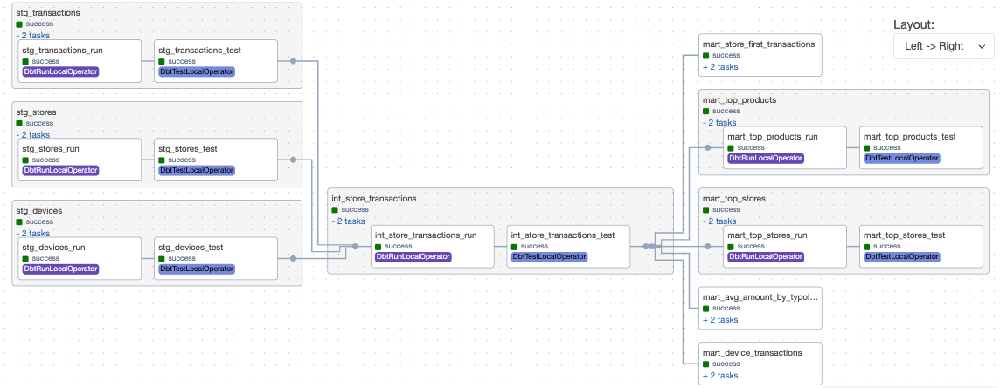

# Enterprise Merchants Analytics Pipeline

A production-ready data pipeline that processes merchant transactions and store data using dbt Core, Apache Airflow, and PostgreSQL.

## Architecture

The pipeline consists of several key components:

1. **Analytics Database**
   - Currently uses PostgreSQL for demonstration
   - In production, a cloud data warehouse like Snowflake would be recommended for better scalability and performance

2. **Apache Airflow**
   - Runs in a Docker container
   - Uses PostgreSQL as its metadata database
   - Handles workflow orchestration and scheduling
   - Leverages Cosmos to integrate dbt projects directly into Airflow DAGs, providing better visibility and control over dbt transformations.

3. **dbt Core**
   - Handles data transformations
   - Organized in layers: staging, intermediate, and marts
   - Manages data model dependencies

## Project Structure

```
dbt-airflow-design/
├── .env.example                  # Example environment configuration
├── docker-compose.yml            # Container orchestration
├── Dockerfile                    # Airflow container config
├── requirements.txt              # Python dependencies
├── dbt-requirements.txt         # dbt specific dependencies
├── data/                        # Sample data directory
│   ├── transactions.csv
│   ├── stores.csv
│   └── devices.csv
├── db/                          # Analytics Warehouse initialization
│   ├── Dockerfile
│   ├── init.sql
│   ├── load_data.py
│   └── requirements.txt
├── dbt/
│   ├── dbt_project.yml          # dbt configuration
│   ├── macros/                  # Reusable SQL logic
│   │   ├── get_custom_schema.sql
│   │   └── custom_tests.sql
│   └── models/
│       ├── staging/            # Raw data cleaning
│       ├── intermediate/       # Business logic
│       └── marts/             # Aggregated models
└── dags/                       # Airflow DAG definitions
    └── dbt_daily_run.py       # Daily dbt pipeline
```

## Data Modeling Approach

The project follows a layered data modeling approach to ensure clean, maintainable, and scalable transformations:



*The diagram above shows the data lineage of our dbt models, illustrating how data flows from staging through intermediate to marts layer.*

The dbt project is translated into an Airflow DAG to enable granular control over model execution (e.g., ability to restart from failure points without full pipeline reruns) and enhanced observability.

### Staging Layer (Basic Cleaning)
The staging layer focuses on basic data cleaning and standardization:
- Renames columns to follow consistent naming conventions
- Performs basic data type conversions
- Implements simple data quality checks
- No business logic at this stage

Models:
- `stg_devices`: Standardizes device data, mapping raw fields (id → device_id, type → device_type)
- `stg_stores`: Cleans store information with proper column naming (id → store_id, name → store_name)
- `stg_transactions`: Incrementally processes transaction data with proper timestamps and amounts

### Intermediate Layer (Wide Tables)
The intermediate layer joins related tables and implements initial business logic:
- Creates denormalized views of the data
- Combines related tables through joins
- Prepares data for final aggregations

Models:
- `int_store_transactions`: Combines transaction data with store and device information, creating a wide table that includes:
  - Transaction details (ID, timestamp, amount)
  - Store information (ID, name, address, city, country)
  - Device details (ID, type)

### Marts Layer (Aggregated Data)
The marts layer creates final business-facing data models with specific use cases:
- Implements complex business logic
- Creates aggregated views
- Provides data ready for reporting and analysis

Models:
- `mart_top_stores`: Answers "Who are our best-performing stores?"
  - Store identification (ID and name)
  - Total unique transaction count
  - Total transaction amount
  - Orders results by total amount in descending order
- `mart_store_first_transactions`: Answers "How quickly do stores become active?"
  - First transaction timestamp
  - Fifth transaction timestamp
  - Time taken to reach fifth transaction
- `mart_device_transactions`: Answers "What's the distribution of transactions across device types?"
  - Transaction count by device type
  - Transaction percentage distribution
- `mart_top_products`: Answers "What are our best-selling products?"
  - Top 10 products by transaction count
  - Total and average transaction amounts per product
  - Product categorization
- `mart_avg_amount_by_typology`: Answers "How do transaction patterns vary by store type and location?"
  - Average transaction amount by store typology and country
  - Transaction count and store count per group
  - Total amount per typology-country combination

Each layer builds upon the previous one, ensuring:
- Clear data lineage
- Modular and maintainable code
- Efficient processing
- Easy troubleshooting
- Scalable architecture

## Design Decisions

### Why This Architecture?

1. **Modularity**
   - Separate staging, intermediate, and marts layers
   - Easy to maintain and extend
   - Clear data lineage

2. **Containerization**
   - Consistent environments
   - Easy deployment
   - Scalable infrastructure

3. **dbt Core vs dbt Cloud**
   - Complete control over infrastructure
   - Cost-effective for smaller teams

### Alternative: dbt Cloud
While this project uses dbt Core, [dbt Cloud](https://github.com/dbt-labs/airflow-dbt-cloud) is a viable alternative that offers:
- Managed infrastructure
- Web-based IDE
- Built-in scheduling
- Job monitoring
- Hosted documentation

Consider dbt Cloud when:
- You need enterprise features (SSO, access control)
- Team collaboration is a priority
- Infrastructure management overhead should be minimized
- Budget allows for managed service

## Setup Instructions

1. Clone the repository:
```
git clone <repository-url>
cd dbt-airflow-design
```

2. Create and configure environment variables:
```bash
cp .env.example .env
# Edit .env with your credentials:
# POSTGRES_USER=airflow
# POSTGRES_PASSWORD=airflow
# POSTGRES_DB=airflow
```

3. Start the services:
```bash
docker-compose up -d
```
This command will spin up 5 Docker containers: 4 for Airflow components (webserver, scheduler, worker, metadata-db) and 1 for the analytics warehouse.

4. Access the services:
- Airflow UI: http://localhost:8080 (username: admin, password: admin)
- PostgreSQL: localhost:5433

5. Configure Warehouse Connection:
- In Airflow UI, go to Admin > Connections
- Add a new connection:
  - Conn Id: analytics_db
  - Conn Type: Postgres
  - Host: db
  - Schema: marts
  - Login: test_user
  - Password: password
  - Port: 5432

## Usage

### Running the Pipeline

The pipeline runs automatically daily at 5 AM through Airflow, but you can also trigger it manually from the Airflow UI.

### Monitoring

1. **Airflow Dashboard**
   - View DAG runs and logs
   - Monitor task status
   - Trigger manual runs

2. **dbt Documentation**
   - Generate docs: `dbt docs generate`
   - Serve locally: `dbt docs serve`
  
## Data Ingestion

### Note on Data Source
For demonstration purposes, this project loads sample CSV data into a PostgreSQL analytics warehouse. In a production environment with large-scale data volumes (millions to billions of records), data would typically:

- Reside in operational databases (e.g., OLTP systems)
- Come from CRM platforms or other enterprise systems
- Be streamed through real-time data pipelines
- Be incrementally loaded using appropriate ETL/ELT tools (e.g., Fivetran, AWS Glue, etc.)

The current approach allows for easy project setup and testing, while the underlying data models and transformations remain applicable for production-scale implementations.

### Raw Data Storage
Sample data files are located in:
```
dbt-airflow-design/
└── data/                   # Raw CSV files location
    ├── stores.csv         # Store master data
    ├── devices.csv        # Device information
    └── transactions.csv   # Transaction records
```

### Loading Process
Data is loaded into the PostgreSQL analytics warehouse through the following process:

1. **Initial Data Load**:
   - Raw CSV files are stored in the `data/` directory
   - The `db/load_data.py` script handles the data ingestion
   - Data is loaded into raw tables in the analytics warehouse
   - Database initialization is managed through `db/init.sql`

2. **dbt Transformations**:
   - Once raw data is loaded, dbt models transform it through staging, intermediate, and marts layers
   - Transformations are executed as part of the Airflow DAG
   - Models are configured in `dbt_project.yml` and organized by layer